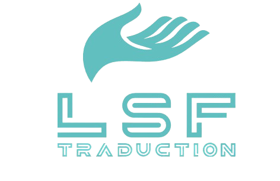

<table>
  <tr>
    <td></td>
    <td><h1>Traducteur LSF vers Texte et Audio</h1></td>
  </tr>
</table>

Ce dépôt contient le projet de [BTS CIEL](https://www.onisep.fr/ressources/univers-formation/formations/post-bac/bts-cybersecurite-informatique-et-reseaux-electronique-option-a-informatique-et-reseaux) (Cybersécurité, Informatique et réseaux, Électronique) visant à développer un système de traduction de la [Langue des Signes Française (LSF)](https://fr.wikipedia.org/wiki/Langue_des_signes_fran%C3%A7aise) vers du texte et de l'audio. L'objectif principal est de faciliter la communication pour les personnes malentendantes et leur entourage. Le système comprend plusieurs modules: capture vidéo, reconnaissance des signes, traduction, et synthèse vocale.

👉 **Téléchargez la dernière version fonctionnelle dans la [section Releases](https://github.com/PlonoXxcoder/Projet-LSF-BTS/releases)**.

**📌Contexte du projet :**
*   **🎓Formation :** BTS CIEL - [Lycée Edouard Branly](https://branly.etab.ac-lyon.fr/spip/)
*   **📚Épreuve :** E6
*   **⏳Durée :** 150 heures
*   **👩‍💻Équipe :** 4 étudiants ([voir section Rôles](#équipe-et-répartition-des-rôles))
*   **👥Public Cible :** Personnes malentendantes et leur entourage

## 🎯Objectifs Généraux du Projet 

1.  **🛠️Développer un système de capture vidéo** et de traitement d'image pour détecter les mains et le visage.
2.  **🤖Implémenter un module d'Intelligence Artificielle** pour la reconnaissance des signes LSF capturés.
3.  **💬Créer un module de traduction** pour convertir les signes reconnus en phrases françaises textuelles, en gérant la grammaire et la syntaxe.
4.  **🎙️Intégrer un module de synthèse vocale** pour convertir le texte traduit en parole audible.
5.  **🖥️Concevoir une interface utilisateur graphique (GUI)** accessible et intuitive.
6.  **⏱️Assurer une traduction en temps réel ou quasi-réel** (latence < 2 secondes).
7.  *🎯*Atteindre une précision de reconnaissance supérieure à 85%.**

## Installation
*À venir — en attendant, consultez la section [Release](https://github.com/PlonoXxcoder/Projet-LSF-BTS/releases) pour récupérer une version fonctionnelle.*

## 🛠️Technologies Utilisées

*   **🐍Python 3.18.10**
*   **⚙️TensorFlow / Keras:** Framework principal pour la construction et l'entraînement du modèle LSTM.
*   **📹MediaPipe:** (Utilisé en amont) Pour l'extraction des points clés du corps et des mains à partir des vidéos. Ce script *ne fait pas* l'extraction, il utilise les résultats.
*   **🖼️OpenCV (`opencv-python`):** Utilisé potentiellement pour le traitement vidéo en amont (non présent dans ce script).
*   **🔢NumPy:** Manipulation efficace des tableaux numériques (séquences de points clés).
*   **📊Scikit-learn:** Pour la division des données (`train_test_split`).
*   **⚖️imbalanced-learn:** (Optionnel) Pour l'équilibrage des classes avec SMOTE.
*   **🎛️Keras Tuner:** Pour l'optimisation automatique des hyperparamètres.
*   **📈Matplotlib:** Pour la visualisation des graphiques d'entraînement.


## Workflow Global du Système

1.  **📷Capture :** La caméra filme l'utilisateur signant (Module [@PlonoXxcoder](https://github.com/PlonoXxcoder)).
2.  **🔍Extraction :** [MediaPipe](https://developers.google.com/mediapipe) détecte et extrait les coordonnées (x, y, z) des points clés (Module [@PlonoXxcoder](https://github.com/PlonoXxcoder)).
3.  **⚙️Normalisation/Prétraitement :** Les séquences sont normalisées et formatées (Module [@PlonoXxcoder](https://github.com/PlonoXxcoder) ou [@aj69210](https://github.com/aj69210)).
4.  **🧠Reconnaissance :** Le modèle IA entraîné prédit le signe LSF (Module [@PlonoXxcoder](https://github.com/PlonoXxcoder) et [@aj69210](https://github.com/aj69210)).
5.  **📜Traduction :** Le(s) signe(s) est/sont traduit(s) en texte français.
6.  **🔊Synthèse Vocale :** Le texte est converti en audio (Module [@Rafael1101001](https://github.com/Rafael1101001)).
7.  **🖥️Affichage :** L'interface utilisateur montre vidéo, texte, et/ou audio (Module [@Walid01100](https://github.com/Walid01100)).


## Équipe et Répartition des Rôles

*   **🎥[@PlonoXxcoder](https://github.com/PlonoXxcoder) :** Responsable du module de capture vidéo et traitement d'image.
*   **🤖[@PlonoXxcoder](https://github.com/PlonoXxcoder) et [@aj69210](https://github.com/aj69210) :** Responsable du développement IA et reconnaissance des signes.
*   **🎨[@Walid01100](https://github.com/Walid01100) :** Responsable de l'interface utilisateur et de l'expérience utilisateur.
*   **🔊[@Rafael1101001](https://github.com/Rafael1101001) :** Responsable de la synthèse vocale et de l'intégration audio.

*Chaque personne est responsable de la documentation, des tests unitaires/d'intégration de sa partie et de la contribution à la présentation finale.*

## 🤝Coordination de l'Équipe

*   📅Réunions hebdomadaires de suivi📋.
*   📝Documentation collaborative sur Wiki📚.


## 💡Contribution

Nous sommes ouverts aux contributions pour améliorer ce projet🚀. Voici comment procéder :

### Pour contribuer :
1. **🛠️Signaler un problème ou suggérer une amélioration**  
   Ouvrez une [issue](https://github.com/PlonoXxcoder/Projet-LSF-BTS/issues) en détaillant :
   - Le contexte🖼️
   - Les étapes pour reproduire le problème (le cas échéant)↩️
   - Le comportement attendu🎯

2. **Contribuer au code**  
   ```bash
   # 1. Forker le dépôt
   # 2. Cloner votre fork
   git clone https://github.com/votre-utilisateur/Projet-LSF-BTS.git
   # 3. Créer une branche
   git checkout -b feature/ma-contribution
   # 4. Après modifications :
   git commit -m "Description claire des changements"
   git push origin feature/ma-contribution
   # 5. Ouvrir une Pull Request
   
**⚠️Bonnes pratiques :**
  - Respecter le style de code existant🔧.
  - Documenter les nouvelles fonctionnalités📘.
  - Ajouter des tests unitaires le cas échéant🔍.


## 📜Licence

Ce projet est open-source et distribué sous la [licence](https://github.com/PlonoXxcoder/Projet-LSF-BTS/blob/main/LICENSE)✅ **MIT**.  

### ✨Vous êtes autorisé à :
- 🚀Utiliser librement le logiciel
- 🔧Modifier le code source
- 📤Redistribuer des copies
- 💼Utiliser à des fins commerciales

### ⚠️Conditions :
- 📄Inclure la notice de licence originale dans toutes les copies
- 🚫Ne pas tenir les auteurs responsables

_Pour plus de détails, consultez le fichier [LICENSE](https://github.com/PlonoXxcoder/Projet-LSF-BTS/blob/main/LICENSE) complet._
## 🙏Remerciements

Nous tenons à remercier :
- 🌟Les contributeurs du projet.
- 🖥️Les créateurs des bibliothèques open-source utilisées dans ce projet.
- 🎓Nos professeurs et mentors pour leur soutien et leurs conseils.

## 🆘Support

Si vous rencontrez des problèmes ou avez des questions, n'hésitez pas à ouvrir une issue sur GitHub💻️ ou à nous contacter directement✉️.


## FAQ

**Q : Comment puis-je exécuter le projet ?**
R : Suivez les instructions dans la section [Installation](#installation). Assurez-vous d'avoir Python 3.18.10 installé et de créer un environnement virtuel pour gérer les dépendances.

**Q : Comment puis-je contribuer au projet ?**
R : Consultez la section [Contribution](#contribution) pour plus de détails. Nous accueillons les contributions sous forme de nouvelles fonctionnalités, corrections de bugs, ou améliorations de la documentation.

**Q : Quelles sont les technologies utilisées dans ce projet ?**
R : Le projet utilise principalement Python 3.18.10, TensorFlow/Keras pour l'IA, MediaPipe pour l'extraction des points clés, OpenCV pour le traitement vidéo, NumPy pour la manipulation des tableaux, Scikit-learn pour la division des données, et Matplotlib pour la visualisation.

**Q : Comment puis-je tester le projet ?**
R : Chaque module dispose de tests unitaires et d'intégration. Vous pouvez exécuter ces tests en utilisant les commandes fournies dans la documentation de chaque module.

**Q : Le projet est-il compatible avec d'autres langues des signes ?**
R : Actuellement, le projet est conçu pour la Langue des Signes Française (LSF). Cependant, l'architecture est suffisamment flexible pour être adaptée à d'autres langues des signes avec les données et modèles appropriés.

**Q : Comment puis-je signaler un bug ou suggérer une amélioration ?**
R : Vous pouvez ouvrir une issue sur GitHub en décrivant le problème ou la suggestion de manière détaillée. Plus vous fournirez d'informations, plus il sera facile pour nous de traiter votre demande.

**Q : Le projet est-il open-source ?**
R : Oui, le projet est open-source et distribué sous la licence [MIT](LICENSE). Vous êtes libre de l'utiliser, de le modifier et de le distribuer selon les termes de cette licence.

**Q : Comment puis-je configurer les variables d'environnement nécessaires ?**
R : Créez un fichier `.env` à la racine du projet et ajoutez-y les variables d'environnement nécessaires. Un exemple de fichier `.env` est fourni dans la documentation.

**Q : Le projet fonctionne-t-il en temps réel ?**
R : Oui, l'un des objectifs du projet est de fournir une traduction en temps réel ou quasi-réel avec une latence inférieure à 2 secondes.

**Q : Quelle est la précision de reconnaissance du modèle ?**
R : Nous visons une précision de reconnaissance supérieure à 85%. Les performances actuelles peuvent varier en fonction des données d'entraînement et des conditions d'utilisation.

**Q : Comment puis-je obtenir de l'aide si je rencontre des problèmes ?**
R : Vous pouvez ouvrir une issue sur GitHub ou nous contacter directement. Nous ferons de notre mieux pour vous aider à résoudre vos problèmes.

